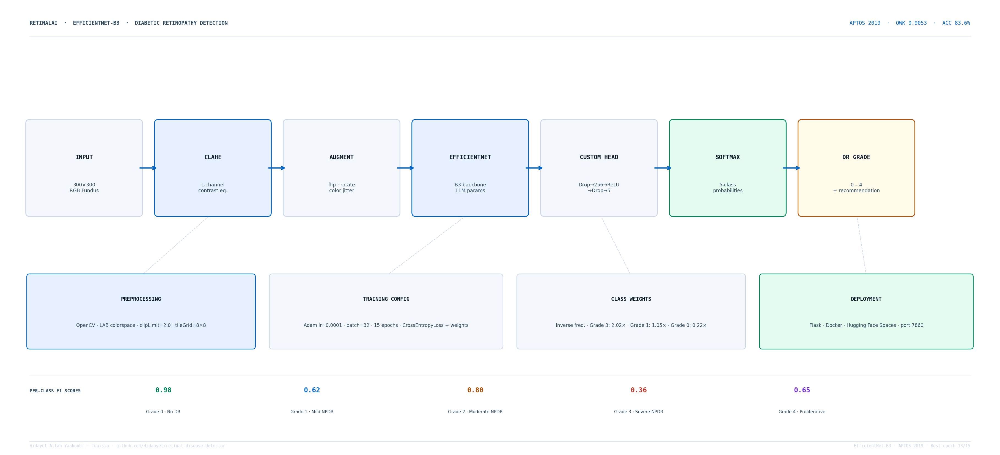
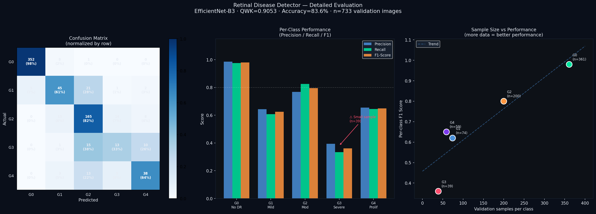

# Retinal Disease Detector

A deep learning web application that detects diabetic retinopathy severity
from fundus retinal images using EfficientNet-B3, achieving medical-grade
classification across 5 severity levels.

---
>  **Project status: Complete** — Model trained, evaluated, and deployed
---

## What it does

A user uploads a fundus retinal image through the web interface. The system
preprocesses the image, passes it through a fine-tuned EfficientNet-B3 model,
and returns a diabetic retinopathy severity grade (0–4) with confidence scores
for each class — in under 2 seconds.

---

## Severity grades

| Grade | Label | Description |
|---|---|---|
| 0 | No DR | Healthy retina |
| 1 | Mild | Microaneurysms only |
| 2 | Moderate | More than mild, less than severe |
| 3 | Severe | Extensive damage, no proliferative signs |
| 4 | Proliferative DR | Most severe, neovascularization present |

---

## System Architecture



---

## Tech stack

| Layer | Technology |
|---|---|
| Model architecture | EfficientNet-B3 (pretrained ImageNet) |
| Deep learning | PyTorch, torchvision |
| Image processing | OpenCV, PIL |
| Web backend | Flask |
| Frontend | HTML, CSS, JavaScript |
| Dataset | APTOS 2019 Blindness Detection (Kaggle) |

---

## Project structure
```
retinal-disease-detector/
├── model/
│   ├── train.py
│   ├── dataset.py
│   └── evaluate.py
├── app/
│   ├── app.py
│   ├── static/
│   └── templates/
├── notebooks/
│   ├── 01_data_exploration.ipynb
│   └── 02_model_training.ipynb
├── data/
│   └── (download instructions in docs/SPEC.md)
├── docs/
│   └── SPEC.md
└── README.md
```
## Results

### Overall Performance
| Metric | Value |
|---|---|
| Quadratic Weighted Kappa (QWK) | **0.9053** |
| Accuracy | **83.6%** |
| Validation set | 733 images (20% stratified split) |
| Training set | 2,929 images (80% stratified split) |
| Random seed | 42 |
| Best epoch | 13 / 15 |

### Per-Class Performance
| Grade | Label | Precision | Recall | F1 | Support |
|---|---|---|---|---|---|
| 0 | No DR | 0.99 | 0.98 | 0.98 | 361 |
| 1 | Mild DR | 0.64 | 0.61 | 0.62 | 74 |
| 2 | Moderate DR | 0.77 | 0.82 | 0.80 | 200 |
| 3 | Severe DR | 0.39 | 0.33 | 0.36 | 39 |
| 4 | Proliferative DR | 0.66 | 0.64 | 0.65 | 59 |

### Honest Assessment
Grade 3 (Severe DR) shows the weakest performance (F1=0.36) due to
the smallest validation sample (n=39). The scatter plot analysis
confirms a direct relationship between sample size and per-class
performance — this is a data limitation, not a model failure.
Collecting more Grade 3 examples or applying targeted augmentation
would directly address this gap.

### Comparison to Baseline
| Model | QWK |
|---|---|
| Random baseline | 0.000 |
| Simple CNN | ~0.700 |
| **EfficientNet-B3 (Mouna)** | **0.9053** |
| APTOS 2019 competition winner | ~0.930 |

### Evaluation Visualization



### Data Split Details
- **Dataset:** APTOS 2019 Blindness Detection (Kaggle)
- **Total images:** 3,662 fundus photographs
- **Split:** 80/20 stratified by diagnosis grade
- **Train:** 2,929 images
- **Validation:** 733 images
- **No separate test set** — APTOS competition used a private
  leaderboard as test set; internal validation on 733-image split
  is reported here
- **Cross-validation:** Not performed — single split with fixed
  random seed 42 for reproducibility

---
##  Live Demo

**Try it here:** https://huggingface.co/spaces/hidayet-yaakoubi/retinal-disease-detector

Upload any fundus retinal image and get an instant diabetic retinopathy severity grade.

---

## Progress log

- [x] Project defined and documented
- [x] Data exploration
- [x] Model training — kappa 0.9053
- [x] Model evaluation
- [x] Web app — working locally
- [x] Deployed online — live public demo
- [ ] Demo video

---
##  Full Project Report

For a detailed explanation of the dataset, model architecture, training methodology, and results, see the **[full project report](docs/Retinal_Disease_Detector_Report.pdf)**.

---

## Author

**Hidayet Allah Yaakoubi**
BME — Tunisia