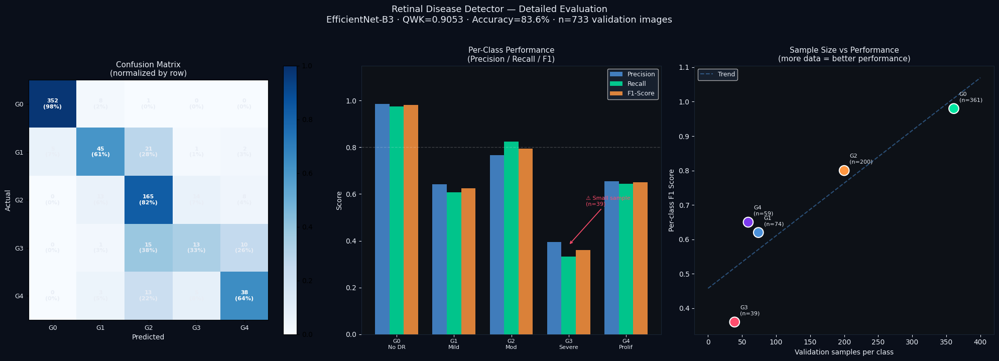

Training code lives in `model/train.py` (see `notebooks/02_model_training.ipynb`
for the original exploratory run). Model weights (`best_model.pth`) are
tracked via Git LFS and loaded at runtime.

## Results

### Overall performance

| Metric | Value |
|---|---|
| Quadratic Weighted Kappa (QWK) | **0.9053** |
| Accuracy | **83.6%** |
| Validation set | 733 images (20%, stratified split) |
| Training set | 2,929 images (80%, stratified split) |
| Random seed | 42 |
| Best epoch | 13 / 15 |

### Per-class performance

| Grade | Label | Precision | Recall | F1 | Support |
|---|---|---|---|---|---|
| 0 | No DR | 0.99 | 0.98 | 0.98 | 361 |
| 1 | Mild DR | 0.64 | 0.61 | 0.62 | 74 |
| 2 | Moderate DR | 0.77 | 0.82 | 0.80 | 200 |
| 3 | Severe DR | 0.39 | 0.33 | 0.36 | 39 |
| 4 | Proliferative DR | 0.66 | 0.64 | 0.65 | 59 |

### Honest assessment

Grade 3 (Severe DR) shows the weakest performance (F1 = 0.36), driven mainly
by its small validation sample (n = 39) — a data limitation rather than a
modeling failure. Collecting more Grade 3 examples, or applying targeted
augmentation for that class, would directly address this gap.

The model has also not been trained to distinguish **post-treatment eyes**
from untreated pathology. APTOS 2019 does not label treatment history, so an
eye with laser photocoagulation scarring (a grid of small, deliberately
placed pale lesions from prior treatment) can visually resemble hard
exudates and gets graded as active Moderate–Severe NPDR rather than
recognized as previously treated. This is a known, unresolved limitation of
the current model.

### Comparison to baseline

| Model | QWK |
|---|---|
| Random baseline | 0.000 |
| Simple CNN | ~0.700 |
| **This model (EfficientNet-B3)** | **0.9053** |
| APTOS 2019 competition winner | ~0.930 |

### Evaluation visualization

### Data split details

- **Dataset:** APTOS 2019 Blindness Detection (Kaggle)
- **Total images:** 3,662 fundus photographs
- **Split:** 80/20, stratified by diagnosis grade
- **Train:** 2,929 images
- **Validation:** 733 images
- **No separate test set** — the APTOS competition used a private
  leaderboard as its test set; internal validation on the 733-image split
  is reported here
- **Cross-validation:** not performed — a single split with fixed random
  seed 42 is used for reproducibility

## Live demo

**Try it here:** https://huggingface.co/spaces/hidayet-yaakoubi/retinal-disease-detector

Upload any fundus retinal image and get an instant diabetic retinopathy
severity grade.

## Progress log

- [x] Project defined and documented
- [x] Data exploration
- [x] Model training — kappa 0.9053
- [x] Model evaluation
- [x] Web app — working locally
- [x] Deployed online — live public demo
- [ ] Demo video

## Full project report

For a detailed explanation of the dataset, model architecture, training
methodology, and results, see the
[full project report](docs/Retinal_Disease_Detector_Report.pdf).

## Author

**Hidayet Allah Yaakoubi**
BME — Tunisia